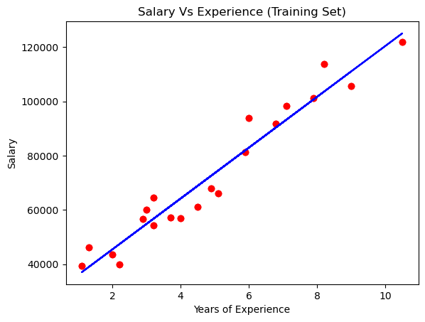
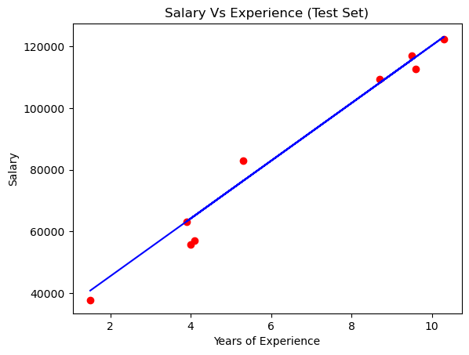

# Simple Linear Regression Projects

Welcome to the Simple Linear Regression Projects repository. This folder contains various projects related to regression analysis in machine learning.

## Table of Contents
- [Introduction](#introduction)
- [Projects](#projects)
- [License](#license)

## Introduction

This repository includes simple regression projects that demonstrate different techniques and models used in regression analysis. The project is designed to help you understand and implement regression algorithms.

## Projects

### 1. Simple Linear Regression for the training set

### 2. Simple Linear Regression for the test set

## License

This project is licensed under the MIT License. See the [LICENSE](LICENSE) file for details.